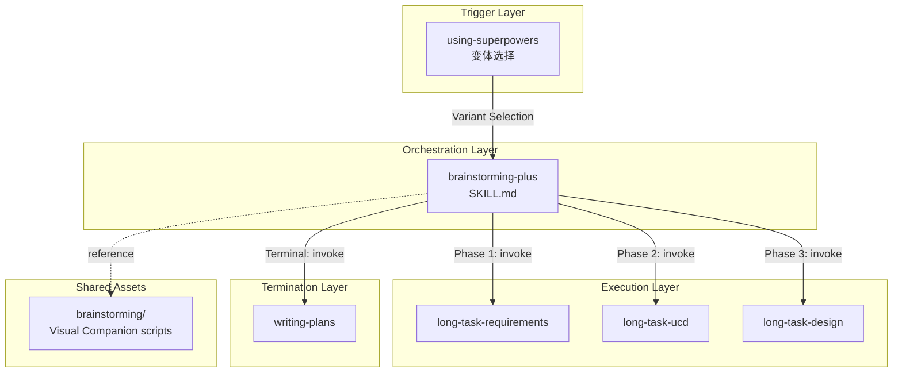
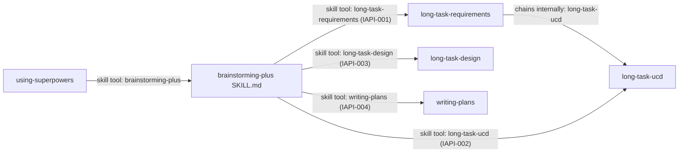
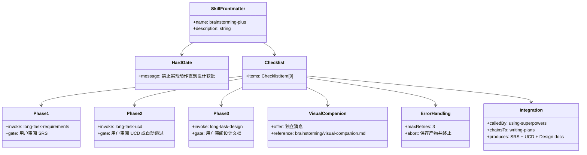
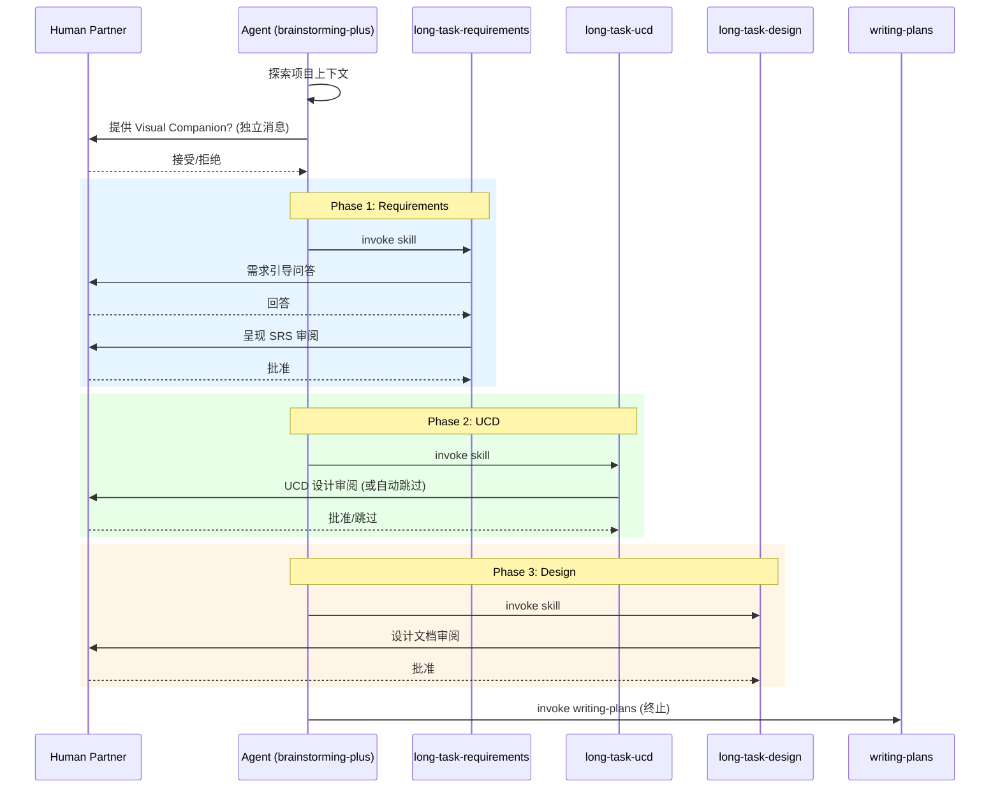
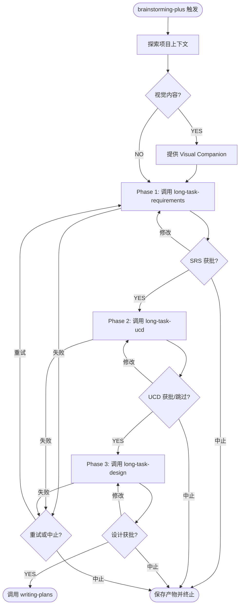
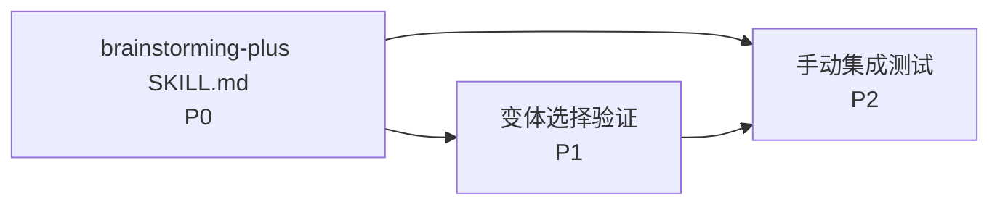

# Brainstorming Plus Skill — Design Document

**Date**: 2026-04-20
**Status**: Draft
**SRS Reference**: docs/plans/2026-04-20-brainstorming-plus-srs.md

## 1. Design Drivers

- **CON-001 零依赖**：brainstorming-plus 为纯 Markdown，不引入任何第三方依赖
- **CON-002 不修改 long-task-* skill**：直接调用现有 skill，不做任何修改
- **IFR-001~003**：通过 Skill tool 调用 long-task-requirements/ucd/design
- **IFR-005**：引用 brainstorming skill 的 Visual Companion 脚本
- **NFR-001 多平台兼容**：SKILL.md 内容为纯 Markdown，所有平台通用

## 2. Approach Selection

**选择方案 A：单一 SKILL.md 内联编排**。

替代方案 B（SKILL.md + 阶段参考文件）被否决，因为 brainstorming-plus 是纯编排 skill，无复杂业务逻辑需要拆分。项目中的 brainstorming、writing-plans 等 skill 均采用单一 SKILL.md 结构，保持一致性。

## 3. Architecture

### 3.1 Architecture Overview

brainstorming-plus 是一个编排层 skill，位于 using-superpowers（变体选择）和三个 long-task skill 之间。它不包含任何业务逻辑，仅负责：

1. 初始化（探索上下文、提供 Visual Companion）
2. 按序调用三个 long-task skill
3. 管理阶段间的用户审批门控
4. 终止时调用 writing-plans

### 3.2 Logical View

### 3.3 Component Diagram

> 注：long-task-requirements 内部会自动链到 long-task-ucd。brainstorming-plus 需要感知这一行为，避免重复调用。详见设计笔记。

### 3.4 Tech Stack Decisions

- **纯 Markdown**：SKILL.md 内容为 Markdown + YAML frontmatter + Graphviz dot 流程图
- **零依赖**：不引入任何库、工具或外部服务
- **Graphviz dot** 而非 Mermaid：遵循 brainstorming 原版 skill 的流程图约定

## 4. Key Feature Designs

### 4.1 Feature: brainstorming-plus 编排流程 (FR-001~009)

#### 4.1.1 Overview

brainstorming-plus 是一个编排 skill，按序调用 long-task-requirements → long-task-ucd → long-task-design，并在阶段间提供用户审批门控。完成后调用 writing-plans 作为终止状态。

#### 4.1.2 SKILL.md 内容结构

#### 4.1.3 Sequence Diagram

#### 4.1.4 Flow Diagram

#### 4.1.5 Design Notes

**关键设计决策 1：long-task-requirements 的内部链式调用**

long-task-requirements 在 SRS 审批后会自动调用 long-task-ucd（Step 16: "Transition to UCD"）。这意味着：
- brainstorming-plus 调用 long-task-requirements 时，如果让其完整执行，它会自动进入 UCD 阶段
- **解决方案**：brainstorming-plus 应指示 agent 在调用 long-task-requirements 时，仅执行到 SRS 审批完成，不跟随其内部的链式调用。具体做法是在 SKILL.md 中明确说明："调用 long-task-requirements skill，在其完成 SRS 审批后停止，不要跟随其内部的 long-task-ucd 调用。"
- 同理，long-task-ucd 完成后会自动调用 long-task-design，需要类似的指示

> **重要**：这与 CON-002（不修改 long-task skill）不冲突。我们不是修改 long-task skill 的行为，而是在 brainstorming-plus 的指令中明确 agent 应如何协调这些 skill 的执行边界。

**关键设计决策 2：阶段边界的用户审批**

每个 long-task skill 内部已包含用户审阅门控（SRS review、UCD review、Design review）。brainstorming-plus 不需要添加额外的审批机制，但需要确保 agent 在 skill 完成后、进入下一阶段前，向用户提供一个清晰的阶段过渡摘要。

**关键设计决策 3：Visual Companion 复用**

Visual Companion 的脚本和指南位于 `skills/brainstorming/` 目录。brainstorming-plus 通过引用路径 `skills/brainstorming/visual-companion.md` 复用这些资源，不创建副本。

#### 4.1.6 Integration Surface

**Provides:**

| Consumer | Contract ID | Method | Response |
|----------|------------|--------|----------|
| writing-plans | IAPI-004 | skill tool invoke | 设计文档路径 |

**Requires:**

| Provider | Contract ID | Method | Notes |
|----------|------------|--------|-------|
| using-superpowers | IAPI-000 | 变体选择触发 | 已实现 |
| long-task-requirements | IAPI-001 | skill tool invoke | 生成 SRS |
| long-task-ucd | IAPI-002 | skill tool invoke | 生成 UCD（可自动跳过） |
| long-task-design | IAPI-003 | skill tool invoke | 生成设计文档 |
| brainstorming/visual-companion | IAPI-005 | 文件引用 | Visual Companion 指南和脚本 |

## 5. Data Model

[Not applicable — 纯 Markdown skill，无持久化数据]

## 6. API / Interface Design

### 6.1 External Interfaces

| ID | External System | Direction | Protocol | Data Format |
|----|----------------|-----------|----------|-------------|
| IFR-001 | long-task-requirements | Outbound (invoke) | Skill tool | N/A |
| IFR-002 | long-task-ucd | Outbound (invoke) | Skill tool | N/A |
| IFR-003 | long-task-design | Outbound (invoke) | Skill tool | N/A |
| IFR-004 | writing-plans | Outbound (invoke) | Skill tool | N/A |
| IFR-005 | brainstorming Visual Companion | Outbound (reference) | File read | Markdown/HTML/JS |

### 6.2 Internal API Contracts

| Contract ID | Provider | Consumer(s) | Endpoint / Method | Notes |
|-------------|----------|-------------|-------------------|-------|
| IAPI-000 | using-superpowers | brainstorming-plus | 变体选择触发 | 已实现 |
| IAPI-001 | long-task-requirements | brainstorming-plus | skill tool invoke | 返回 SRS 路径 |
| IAPI-002 | long-task-ucd | brainstorming-plus | skill tool invoke | 返回 UCD 路径或 auto-skip |
| IAPI-003 | long-task-design | brainstorming-plus | skill tool invoke | 返回设计文档路径 |
| IAPI-004 | writing-plans | brainstorming-plus | skill tool invoke | 终止状态 |
| IAPI-005 | brainstorming/ | brainstorming-plus | file path reference | Visual Companion |

## 7. UI/UX Approach

[Not applicable — 无 UI 特性，SRS 无 UI 需求]

## 8. Third-Party Dependencies

| Library / Framework | Version | Purpose | License | Compatibility Notes |
|---|---|---|---|---|
| (无) | N/A | N/A | N/A | 零依赖设计 |

## 9. Testing Strategy

- **测试哲学**：基于 skill 的行为验证，通过 adversarial pressure testing
- **验证方法**：在至少一个平台（Claude Code 或 OpenCode）上手动触发 brainstorming-plus，验证各阶段编排逻辑
- **关键测试场景**：
  1. 变体选择正确触发 Plus 模式
  2. Phase 1 完成后正确过渡到 Phase 2
  3. UCD 自动跳过时正确过渡到 Phase 3
  4. 中途中止时产物保存
  5. 终止时正确调用 writing-plans
- **边界**：各 long-task skill 内部行为的测试由其自身负责

## 10. Deployment / Infrastructure

[Not applicable — 纯 Markdown skill，随 superpowers 项目一起部署]

## 11. Development Plan

### 11.1 Milestones

| Milestone | Scope | Exit Criteria |
|---|---|---|
| M1: Foundation | 重写 brainstorming-plus SKILL.md | SKILL.md 遵循项目约定，frontmatter/HARD-GATE/checklist/Integration 齐全 |
| M2: Polish | 验证变体选择 + 手动测试 | 在至少一个平台验证完整流程 |

### 11.2 Task Decomposition & Priority

| Priority | Feature | Mapped FRs | Dependencies | Milestone | Rationale |
|---|---|---|---|---|---|
| P0 - Critical | brainstorming-plus SKILL.md | FR-001~009 | None | M1 | 核心编排逻辑 |
| P1 - High | 变体选择验证 | FR-007 | P0 | M2 | 确保触发机制正确 |
| P2 - Medium | 手动集成测试 | NFR-001 | P0, P1 | M2 | 验证多平台兼容 |

### 11.3 Dependency Chain

### 11.4 Risk & Mitigation

| Risk | Impact | Likelihood | Mitigation |
|---|---|---|---|
| long-task skill 内部链式调用与 brainstorming-plus 编排冲突 | High | Med | SKILL.md 中明确指示执行边界 |
| Visual Companion 引用路径在不同平台不一致 | Med | Low | 使用相对路径引用 |
| Agent 不遵循 SKILL.md 中的执行边界指示 | High | Med | 使用 HARD-GATE 和明确的 "DO NOT" 指令 |

## 12. Open Questions / Risks

- **长期风险**：如果 long-task skill 的内部链式调用行为发生变化，brainstorming-plus 的编排逻辑可能需要同步调整。缓解措施：brainstorming-plus SKILL.md 中的过渡指令应明确描述期望行为，而非依赖 long-task skill 的内部实现。

## 13. Codebase Conventions & Constraints

### 13.1~13.4

[Not applicable — 纯 Markdown skill，无代码约束]

### 13.5 Coding Style Summary

| Rule | Convention | Source |
|------|-----------|--------|
| SKILL.md frontmatter | YAML: name + description (Use when...) | writing-skills skill |
| 流程图 | Graphviz dot (非 Mermaid) | brainstorming 原版 skill |
| 语气 | 第二人称祈使（You MUST/Do NOT） | 所有 skill 约定 |
| Integration 段 | Called by / Chains to / Requires / Produces | subagent-driven-development 等参考 |

### 13.6~13.8

[Not applicable — 无构建、CI/CD、提交流程]
