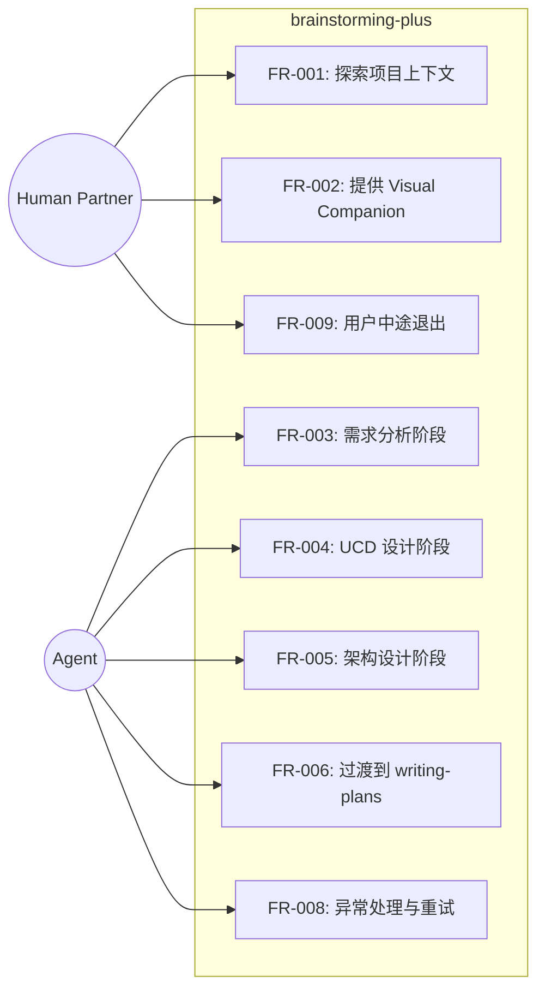
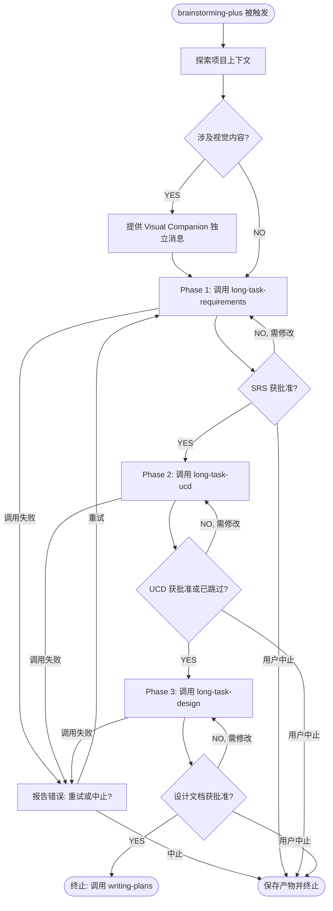
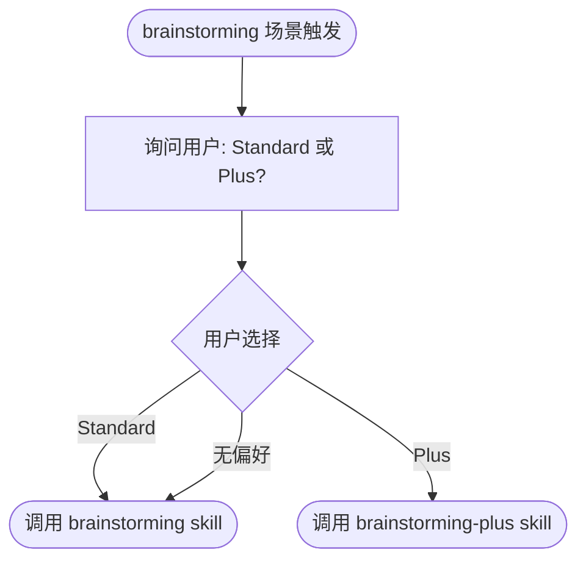

# Brainstorming Plus Skill — Software Requirements Specification

**Date**: 2026-04-20
**Status**: Draft
**Standard**: Aligned with ISO/IEC/IEEE 29148

## 1. Purpose & Scope

Brainstorming Plus 是 superpowers brainstorming skill 的高级变体。它通过编排 long-task 流水线（requirements → UCD → design）替代原版的即兴式 brainstorming 流程，为复杂项目提供更结构化的需求分析和设计过程。

### 1.1 In Scope

- 创建一个新的 `brainstorming-plus` skill，编排三个 long-task skill 的顺序执行
- 在 using-superpowers 中提供变体选择机制（已实现）
- 在每个阶段之间提供用户审批门控
- 包含 Visual Companion 支持
- 终止状态为调用 writing-plans skill

### 1.2 Out of Scope

- 修改现有 long-task-requirements、long-task-ucd、long-task-design skill（直接使用，不做修改）
- 修改原版 brainstorming skill 的逻辑
- 添加新的 long-task skill 或修改 long-task 流水线

### 1.3 Problem Statement

**Jobs-to-be-Done**: 当面对复杂项目需要深入的需求分析和结构化设计时，我希望能使用 long-task 流水线进行系统化的需求→UCD→设计过程，以便产出更完整、可验证的设计文档。

[Not applicable — Lite track]

## 2. Glossary & Definitions

| Term | Definition | Do NOT confuse with |
|------|-----------|---------------------|
| brainstorming-plus | 本 skill，brainstorming 的高级变体 | 原版 brainstorming skill |
| Phase | brainstorming-plus 流水线中的一个阶段（requirements/UCD/design） | long-task 流水线中的 phase |
| Visual Companion | 浏览器端可视化伴侣，用于展示 mockup 和图表 | 任何 UI 组件 |
| Variant Selection | using-superpowers 中的变体选择机制 | skill 内部的条件分支 |

## 3. Stakeholders & User Personas

| Persona | Technical Level | Key Needs | Access Level |
|---------|----------------|-----------|--------------|
| Human Partner | 中高级开发者 | 复杂项目的结构化 brainstorming | 完全控制 |
| Agent | 技术执行者 | 按编排流程调用各 skill | 执行者 |

### 3.1 Use Case View

## 4. Functional Requirements

### FR-001: 探索项目上下文
**Priority**: Must
**EARS**: When brainstorming-plus skill 被触发，the system shall 探索项目上下文（文件、文档、最近提交）。
**Visual output**: N/A — backend-only
**Acceptance Criteria**:
- Given brainstorming-plus 被触发，when agent 开始执行，then agent 读取项目文件、文档和最近提交
- Given 项目涉及视觉相关问题，when 探索完成后，then agent 评估是否需要提供 Visual Companion

### FR-002: 提供 Visual Companion
**Priority**: Should
**EARS**: Where 即将到来的问题涉及视觉内容（mockup、布局、图表），the system shall 提供浏览器端 Visual Companion。
**Visual output**: 浏览器端打开 Visual Companion 页面
**Acceptance Criteria**:
- Given 问题涉及视觉内容，when agent 评估后决定提供，then agent 发送独立的 Visual Companion 邀请消息
- Given 用户拒绝 Visual Companion，when agent 收到拒绝回复，then agent 继续纯文本 brainstorming
- Given 用户接受 Visual Companion，when 后续问题需要视觉展示，then agent 按问题决定使用浏览器或终端

### FR-003: 需求分析阶段
**Priority**: Must
**EARS**: When 项目上下文探索完成，the system shall 调用 long-task-requirements skill 进行系统化需求分析，生成 SRS 文档。
**Visual output**: N/A — 由 long-task-requirements skill 内部决定
**Acceptance Criteria**:
- Given 项目上下文已探索，when agent 进入 Phase 1，then agent 调用 long-task-requirements skill
- Given long-task-requirements 完成，when SRS 文档已生成，then agent 提示用户审阅 SRS 文档
- Given 用户审阅通过，when SRS 获得批准，then agent 进入 Phase 2
- Given 用户要求修改，when SRS 需要修订，then agent 协调修改后重新审阅

### FR-004: UCD 设计阶段
**Priority**: Must
**EARS**: When SRS 文档获得用户批准，the system shall 调用 long-task-ucd skill 进行 UI 组件设计，生成 UCD 文档。
**Visual output**: N/A — 由 long-task-ucd skill 内部决定
**Acceptance Criteria**:
- Given SRS 已获批准，when agent 进入 Phase 2，then agent 调用 long-task-ucd skill
- Given long-task-ucd 完成，when UCD 文档已生成，then agent 提示用户审阅 UCD 文档
- Given 用户审阅通过，when UCD 获得批准，then agent 进入 Phase 3
- Given 项目无 UI 特性，when long-task-ucd 自动跳过，then agent 直接进入 Phase 3

### FR-005: 架构设计阶段
**Priority**: Must
**EARS**: When UCD 文档获得用户批准（或被自动跳过），the system shall 调用 long-task-design skill 输出架构设计文档。
**Visual output**: N/A — 由 long-task-design skill 内部决定
**Acceptance Criteria**:
- Given UCD 已获批准或已跳过，when agent 进入 Phase 3，then agent 调用 long-task-design skill
- Given long-task-design 完成，when 设计文档已生成，then agent 提示用户审阅设计文档
- Given 用户审阅通过，when 设计文档获得批准，then agent 进入终止状态
- Given 用户要求修改，when 设计文档需要修订，then agent 协调修改后重新审阅

### FR-006: 过渡到 writing-plans
**Priority**: Must
**EARS**: When 设计文档获得用户批准，the system shall 调用 writing-plans skill 创建实施计划。
**Visual output**: N/A — backend-only
**Acceptance Criteria**:
- Given 设计文档已获批准，when brainstorming-plus 到达终止状态，then agent 调用 writing-plans skill
- Given writing-plans 被调用，when brainstorming-plus 终止，then 不调用任何其他 skill

### FR-007: 变体选择集成
**Priority**: Must
**EARS**: When using-superpowers 触发 brainstorming 场景，the system shall 通过变体选择机制让用户选择 Standard 或 Plus 模式。
**Visual output**: 终端显示变体选择提示
**Acceptance Criteria**:
- Given brainstorming 场景被触发，when agent 读取 using-superpowers 的变体选择段，then agent 先询问用户选择 Standard 或 Plus
- Given 用户选择 Standard，when agent 收到选择，then agent 调用原版 brainstorming skill
- Given 用户选择 Plus，when agent 收到选择，then agent 调用 brainstorming-plus skill
- Given 用户未表达偏好，when agent 未收到明确选择，then agent 使用 Standard 模式

### FR-008: 异常处理与重试
**Priority**: Must
**EARS**: If long-task skill 调用失败或不可用，the system shall 向用户报告错误并提供重试或中止选项。
**Visual output**: 终端显示错误信息和选项
**Acceptance Criteria**:
- Given long-task-requirements/ucd/design 调用失败，when agent 检测到失败，then agent 向用户报告具体错误信息
- Given 用户选择重试，when agent 收到重试指令，then agent 重新尝试调用失败的 skill
- Given 用户选择中止，when agent 收到中止指令，then agent 保存当前进度并终止 brainstorming-plus
- Given 某个阶段的审阅循环超过 3 轮仍未通过，when agent 检测到循环次数，then agent 提示用户考虑简化范围或中止

### FR-009: 用户中途退出
**Priority**: Should
**EARS**: When 用户在任何阶段明确表示要中止流程，the system shall 保存当前已完成阶段的产物并终止 brainstorming-plus。
**Visual output**: 终端显示已保存产物路径和终止确认
**Acceptance Criteria**:
- Given 流程在任意阶段执行中，when 用户明确要求中止，then agent 确认已完成的产物（如 SRS、UCD 文档）并告知保存位置
- Given 用户中止后想恢复，when 用户在后续会话中重新触发 brainstorming-plus，then agent 检测已有产物并询问是否从断点继续

#### Flow: brainstorming-plus 主流程

#### Flow: 变体选择

## 5. Non-Functional Requirements

| ID | Category (ISO 25010) | Requirement | Measurable Criterion | Measurement Method |
|----|---------------------|-------------|---------------------|-------------------|
| NFR-001 | Compatibility | 兼容所有 superpowers 支持的平台 | Claude Code、Cursor、OpenCode、Gemini 均可触发 | 手动测试 |
| NFR-002 | Maintainability | 不修改现有 long-task skill | 代码审查：无对 long-task-* skill 文件的修改 | 代码审查 |
| NFR-003 | Usability | 零依赖，无外部工具要求 | skill 内容为纯 markdown，不引入新依赖 | 代码审查 |
| NFR-004 | Maintainability | SKILL.md 遵循项目约定 | frontmatter、HARD-GATE、checklist、Integration 段齐全 | 对照 writing-skills skill 审查 |

## 6. Interface Requirements

| ID | External System | Direction | Protocol | Data Format |
|----|----------------|-----------|----------|-------------|
| IFR-001 | long-task-requirements | Outbound (invoke) | Skill tool | N/A |
| IFR-002 | long-task-ucd | Outbound (invoke) | Skill tool | N/A |
| IFR-003 | long-task-design | Outbound (invoke) | Skill tool | N/A |
| IFR-004 | writing-plans | Outbound (invoke) | Skill tool | N/A |
| IFR-005 | Visual Companion scripts | Outbound (reference) | File read | Markdown/HTML/JS |

## 7. Constraints

| ID | Constraint | Rationale |
|----|-----------|-----------|
| CON-001 | 零第三方依赖 | superpowers 项目设计原则 |
| CON-002 | 不修改 long-task-* skill 文件 | 用户要求非必要不做修改 |
| CON-003 | SKILL.md 内容为纯 Markdown | 所有平台通用 |
| CON-004 | 遵循 writing-skills skill 的创作规范 | 项目约定 |

## 8. Assumptions & Dependencies

| ID | Assumption | Impact if Invalid |
|----|-----------|------------------|
| ASM-001 | long-task-requirements、long-task-ucd、long-task-design skill 可正常调用 | 需要排查 skill 加载问题 |
| ASM-002 | using-superpowers 中的变体选择机制已生效（已实现） | 用户无法选择 Plus 模式 |
| ASM-003 | Visual Companion 脚本可从 brainstorming skill 目录复用 | 需要独立实现 Visual Companion |
| ASM-004 | 各 long-task skill 内部已包含用户审阅门控 | 需要在 brainstorming-plus 中额外实现 |

## 9. Acceptance Criteria Summary

| ID | Criterion | Verification |
|----|----------|-------------|
| FR-001 | Agent 探索项目上下文后进入 Phase 1 | 手动测试 |
| FR-002 | Visual Companion 在视觉场景中正确提供 | 手动测试 |
| FR-003 | long-task-requirements 被调用并生成 SRS | 手动测试 |
| FR-004 | long-task-ucd 被调用并生成 UCD | 手动测试 |
| FR-005 | long-task-design 被调用并生成设计文档 | 手动测试 |
| FR-006 | 设计批准后调用 writing-plans | 手动测试 |
| FR-007 | 变体选择在所有场景正确触发 | 手动测试 |
| FR-008 | 异常时提供重试/中止选项 | 手动测试 |
| FR-009 | 用户中途退出时保存产物 | 手动测试 |
| NFR-002 | 无 long-task-* skill 文件被修改 | git diff 验证 |
| NFR-003 | 无新依赖引入 | 代码审查 |

## 10. Traceability Matrix

| Requirement ID | Source | Pain Point Addressed | Verification Method |
|---------------|--------|---------------------|-------------------|
| FR-001 | 用户需求：项目上下文探索 | 缺乏项目理解直接进入设计 | 手动测试 |
| FR-002 | 用户需求：包含 Visual Companion | 纯文本无法展示视觉设计 | 手动测试 |
| FR-003 | 用户需求：使用 long-task-requirements | 复杂项目需求分析不够深入 | 手动测试 |
| FR-004 | 用户需求：使用 long-task-ucd | UI 设计缺乏系统化方法 | 手动测试 |
| FR-005 | 用户需求：使用 long-task-design | 设计文档缺乏结构化输出 | 手动测试 |
| FR-006 | 用户需求：终止状态链到 writing-plans | 设计完成后无法平滑进入实施 | 手动测试 |
| FR-007 | 用户需求：高级选项并存 | 无法选择结构化 brainstorming | 手动测试 |
| FR-008 | SRS 审查发现：缺少失败模式处理 | skill 调用失败无恢复路径 | 手动测试 |
| FR-009 | SRS 审查发现：缺少用户中止处理 | 中途退出丢失进度 | 手动测试 |

## 11. Open Questions

None.
