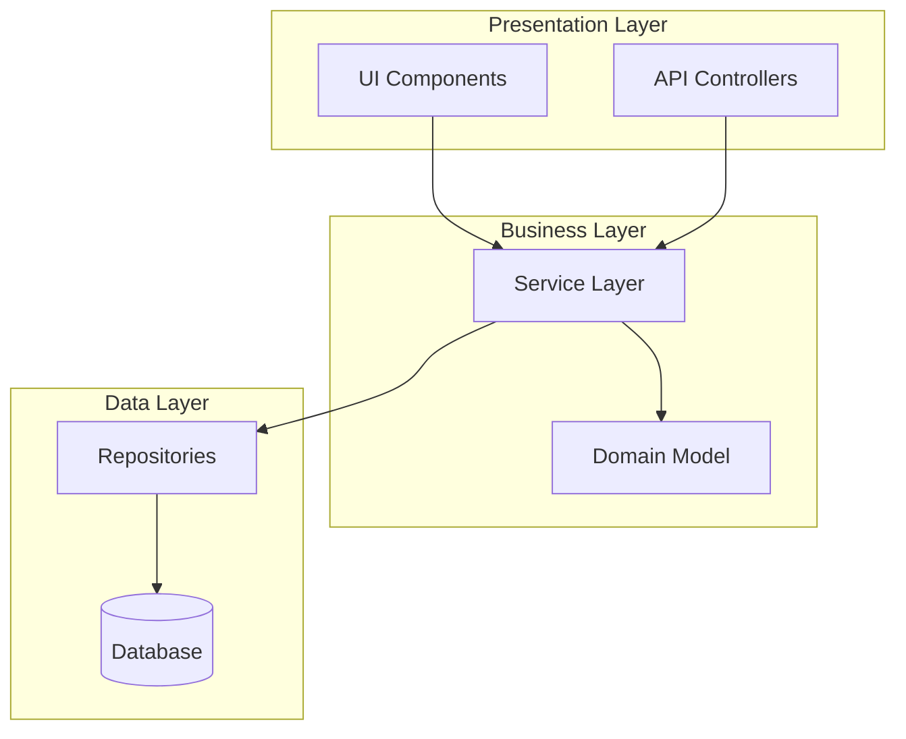
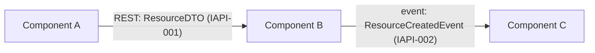
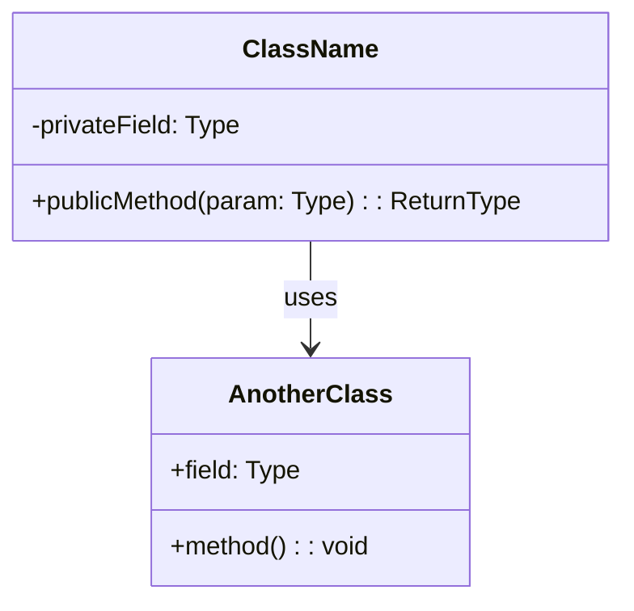
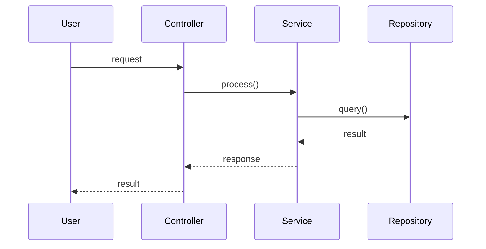
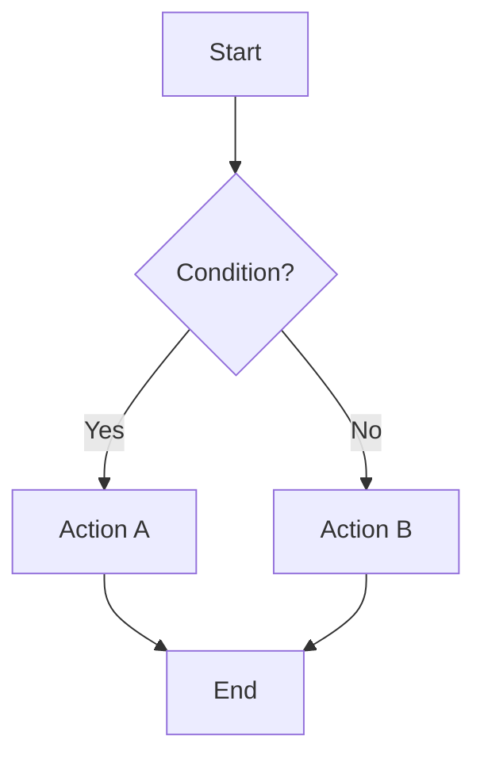
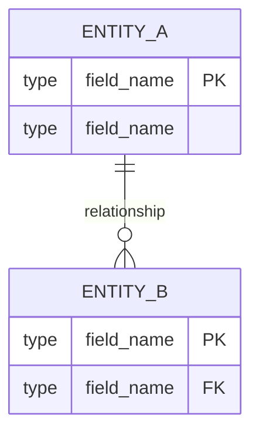
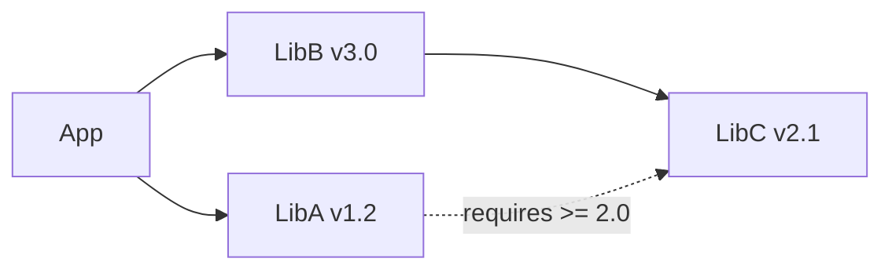
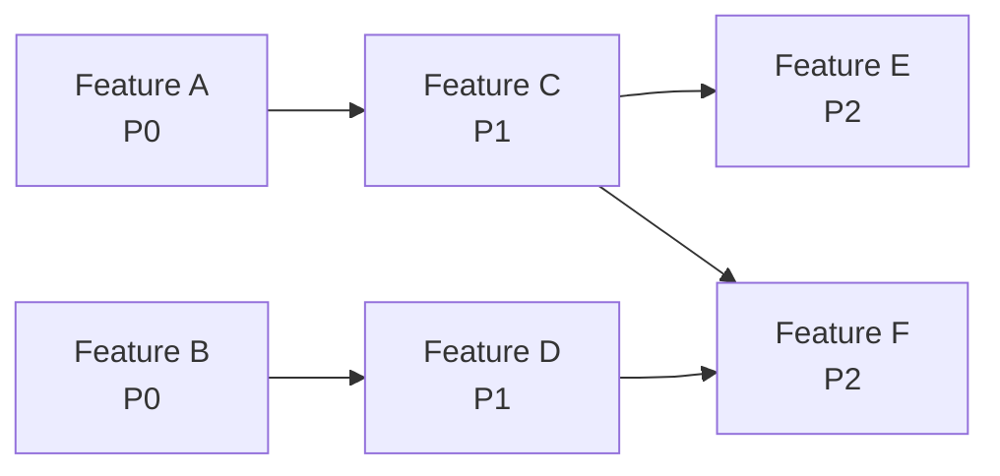

# <Project Name> — Design Document

**Date**: YYYY-MM-DD
**Status**: Approved
**SRS Reference**: docs/plans/YYYY-MM-DD-<topic>-srs.md

## 1. Design Drivers
[Key SRS inputs: NFR thresholds, constraints, interface requirements that shaped this design]

## 2. Approach Selection
[Selected approach with justification. Brief mention of alternatives considered.]

## 3. Architecture

### 3.1 Architecture Overview
[High-level system description: key components, their responsibilities, and interactions]

### 3.2 Logical View
[Describe system decomposition into packages/modules/layers. Show major abstractions and their relationships.]



[Replace the example above with the actual logical architecture of the project. Show layers, packages, modules, and their dependency directions.]

### 3.3 Component Diagram

[Show major runtime components and their interactions.
 Every edge MUST include: (1) protocol, (2) schema name referencing a §6.2 Contract ID.]



[Replace the example above with actual components and interactions. An edge without a Contract ID label is a design defect — add a §6.2 row or justify as a framework-level dependency with no runtime data exchange.]

### 3.4 Tech Stack Decisions
[Justify against SRS constraints and NFRs]
[Explain how NFR thresholds will be met by this architecture]

## 4. Key Feature Designs

> **Instructions**: Create one subsection per key feature (or feature group). Each subsection MUST include at least: a class diagram and one behavioral diagram (sequence or flow). For complex features, include all four views.

### 4.N Feature: <Feature Name> (FR-xxx)

#### 4.N.1 Overview
[1-2 sentences: what this feature does, which SRS requirements it satisfies]

#### 4.N.2 Class Diagram
[Show the classes/modules involved, their attributes, methods, and relationships]



#### 4.N.3 Sequence Diagram
[Show the interaction between objects/components for the main success scenario]



#### 4.N.4 Flow Diagram
[Show the process/logic flow including decision points and error paths]



#### 4.N.5 Design Notes
[Key design decisions, edge cases, error handling strategy for this feature]

#### 4.N.6 Integration Surface

**Provides** (other features depend on this):

| Consumer Feature(s) | Contract ID | Endpoint / Method | Response Schema |
|---------------------|-------------|-------------------|----------------|
| [#M Feature B] | [IAPI-001] | [`GET /api/resource/:id`] | [`ResourceDTO`] |

**Requires** (this feature depends on):

| Provider Feature | Contract ID | Endpoint / Method | Request Schema |
|-----------------|-------------|-------------------|---------------|
| [#K Feature C] | [IAPI-002] | [`POST /api/other`] | [`OtherRequest`] |

[If this feature has no cross-feature dependencies, write:
 "Self-contained — no external integration surface."]

[Repeat section 4.N for each key feature or feature group]

## 5. Data Model
[Schemas, relationships, storage strategy]



## 6. API / Interface Design

### 6.1 External Interfaces
[Endpoints, contracts, protocols for external third-party systems]
[Trace to SRS IFR-xxx requirements]

### 6.2 Internal API Contracts

[For each component-to-component interaction in §3.3, define the contract.
 These are consumed by per-feature design SubAgents to ensure integration coherence.]

| Contract ID | Provider Feature | Consumer Feature(s) | Endpoint / Method | Request Schema | Response Schema | Error Codes |
|-------------|-----------------|---------------------|-------------------|---------------|----------------|-------------|
| IAPI-001 | #N Feature A | #M Feature B, #K Feature C | `GET /api/resource/:id` | `{ id: UUID }` | `ResourceDTO { ... }` | 401, 404 |

[Replace the example above with actual internal contracts from §3.3 edges.]

**Schema Definitions** (referenced by table above):

[Use the project's primary language syntax. Define each shared schema used in the table.]

```
// Example — replace with actual schemas
interface ResourceDTO {
  id: string;
  name: string;
  created_at: string; // ISO 8601
}
```

**When to define an internal API contract:**
1. Any component pair connected by an edge in §3.3 → must have a corresponding row
2. If feature A's `dependencies[]` in feature-list.json includes feature B, and A calls B's methods/APIs at runtime → must have a corresponding row
3. Two features sharing persistent state (same DB table/file/cache) → must define the shared schema
4. **Not required**: Pure framework-level dependencies (e.g., feature B depends on feature A's project skeleton but has no runtime calls)

**Granularity rule:** Define contracts to the level where a Consumer can code independently — i.e., the Consumer can write correct calling code and error handling by reading only this table.

## 7. UI/UX Approach
[If applicable. Layout strategy, interaction patterns.]
[Omit if no UI features in SRS]

## 8. Third-Party Dependencies

> **Instructions**: List ALL third-party libraries, frameworks, and tools. Each entry MUST specify an exact version (or version range) and compatibility notes.

| Library / Framework | Version | Purpose | License | Compatibility Notes |
|---|---|---|---|---|
| example-lib | 2.3.1 | [purpose] | MIT | Compatible with Python >= 3.10 |
| another-lib | ^4.0.0 | [purpose] | Apache-2.0 | Requires example-lib >= 2.0 |

### 8.1 Version Constraints
[Document any version pinning rationale, known incompatibilities, or upgrade risks]

### 8.2 Dependency Graph
[Show critical dependency relationships if complex]



## 9. Testing Strategy
[Test types, coverage approach, tooling]
[How SRS acceptance criteria map to test suites]

## 10. Deployment / Infrastructure
[If applicable. Hosting, CI/CD, environments.]
[Omit for library/CLI projects]

## 11. Development Plan

### 11.1 Milestones

| Milestone | Target | Scope | Exit Criteria |
|---|---|---|---|
| M1: Foundation | [date/sprint] | Core infrastructure, project skeleton, CI setup | Build passes, dev environment reproducible |
| M2: Core Features | [date/sprint] | [list high-priority features] | All high-priority features passing |
| M3: Extended Features | [date/sprint] | [list medium-priority features] | All medium-priority features passing |
| M4: Polish & Release | [date/sprint] | NFR verification, documentation, examples | All quality gates met, release-ready |

### 11.2 Task Decomposition & Priority

> **Instructions**: Each row becomes one feature in `feature-list.json`. Group related right-sized FRs (already validated by SRS G1-G6 + S1-S4 bidirectional sizing) into vertical slices. Include Mapped FRs for traceability. Each feature should productively fill one Worker session (~50% of model context window).

| Priority | Feature | Mapped FRs | Dependencies | Milestone | Rationale |
|---|---|---|---|---|---|
| P0 - Critical | [Feature A] | FR-001, FR-002 | None | M1 | Foundation required by all others |
| P1 - High | [Feature B] | FR-003, FR-004, FR-005 | A | M2 | Core value proposition |
| P2 - Medium | [Feature C] | FR-008, FR-009 | B | M3 | Extended functionality |
| P3 - Low | [Feature D] | FR-012 | None | M4 | Nice-to-have |

### 11.3 Dependency Chain
[Show the critical path and feature dependency ordering]



#### Backend→Frontend Dependencies (mandatory for full-stack projects)
The dependency graph MUST explicitly show edges from backend API features to frontend UI features that consume them. This ensures:
- Worker develops backend APIs before frontend pages (dependency satisfaction check in Worker Step 1)
- UI E2E testing via Chrome DevTools MCP has a live backend to test against
- Per-feature ST cases can verify real data flow, not mocked responses

Example: if "User REST API" is Feature A and "User Profile Page" is Feature C, the graph must show `A --> C`.

### 11.4 Risk & Mitigation

| Risk | Impact | Likelihood | Mitigation |
|---|---|---|---|
| [risk description] | High/Med/Low | High/Med/Low | [mitigation strategy] |

## 12. Open Questions / Risks
[Any remaining items to resolve during implementation]

## 13. Codebase Conventions & Constraints

> *This section is auto-populated from `docs/rules/` during design if the project has an existing codebase (brownfield). For greenfield projects, mark "[Not applicable — greenfield project]".*
> *These conventions are binding for all new code unless explicitly overridden elsewhere in this design document. Design overrides are marked with "⚠ Design Override" annotations.*

### 13.1 2nd-Party Library Constraints

> Mandatory internal libraries that replace standard library or 3rd-party alternatives. All new code MUST use these — do not use the replaced APIs directly.

| Domain | Internal Library | Replaces | Import Pattern | Notes |
|--------|-----------------|----------|---------------|-------|
| [e.g., HTTP Client] | [e.g., `@company/http`] | [e.g., axios, fetch] | [e.g., `import { get } from '@company/http'`] | [e.g., All external HTTP calls] |

### 13.2 Prohibited APIs

| Prohibited | Reason | Use Instead |
|------------|--------|-------------|
| [e.g., `console.log`] | [e.g., Structured logging required] | [e.g., `internal.logger`] |

### 13.3 Approved 3rd-Party Libraries

| Purpose | Library | Version | Pinning Strategy |
|---------|---------|---------|-----------------|
| [e.g., Testing] | [e.g., pytest] | [e.g., ^7.4] | [e.g., Range-pinned] |

### 13.4 Static Analysis Tools

> Downstream TDD/Quality skills run these tools directly — the tools read their own config files.

| Tool | Config File | Run Command |
|------|------------|-------------|
| [e.g., eslint] | [e.g., `.eslintrc.json`] | [e.g., `npx eslint .`] |

### 13.5 Coding Style Summary

| Rule | Convention | Source |
|------|-----------|--------|
| [e.g., Variable naming] | [e.g., camelCase] | [e.g., Observed 95% consistency] |
| [e.g., Indentation] | [e.g., 2 spaces] | [e.g., .editorconfig] |

### 13.6 Error Handling Pattern

[Dominant error handling approach: try/catch, Result types, custom Error classes, centralized middleware, etc.]

### 13.7 Build & CI/CD Summary

| Aspect | Value |
|--------|-------|
| Build System | [e.g., npm scripts] |
| CI/CD Platform | [e.g., GitHub Actions] |
| Pre-commit Hooks | [e.g., husky + lint-staged] |
| Code Generation | [e.g., protobuf → src/generated/ (exclude from convention checks)] |

### 13.8 Commit Conventions

| Element | Convention |
|---------|-----------|
| Format | [e.g., Conventional Commits: `feat:`, `fix:`, `chore:`] |
| Subject Length | [e.g., ≤ 72 chars] |
| Branch Naming | [e.g., `feature/<name>`, `fix/<name>`] |
