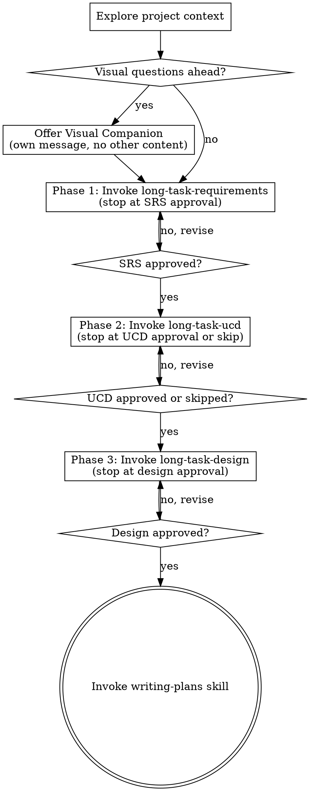

# Brainstorming Plus — Structured Design Pipeline

Enhanced brainstorming that orchestrates the long-task pipeline (requirements → UCD → design) for complex projects needing deeper analysis than the standard brainstorming workflow.

<HARD-GATE>
Do NOT invoke any implementation skill, write any code, scaffold any project, or take any implementation action until a design document has been produced and approved through the full pipeline. This applies to EVERY project regardless of perceived simplicity.
</HARD-GATE>

## Anti-Pattern: "This Is Too Simple For The Pipeline"

Every project goes through this process. The long-task skills adapt their depth automatically (Lite track for simple projects). "Simple" projects are where unexamined assumptions cause the most wasted work. Trust the pipeline — each skill scales to fit.

## Checklist

You MUST create a task for each of these items and complete them in order:

1. **Explore project context** — check files, docs, recent commits, assess scope
2. **Offer visual companion** (if topic will involve visual questions) — this is its own message. See the Visual Companion section below.
3. **Phase 1: Requirements** — invoke long-task-requirements skill; stop at SRS approval (DO NOT follow its internal chain to long-task-ucd)
4. **Phase 1 gate** — confirm SRS approved; summarize what was produced before proceeding
5. **Phase 2: UCD** — invoke long-task-ucd skill; stop at UCD approval or auto-skip (DO NOT follow its internal chain to long-task-design)
6. **Phase 2 gate** — confirm UCD approved or skipped; summarize before proceeding
7. **Phase 3: Design** — invoke long-task-design skill; stop at design document approval (DO NOT follow its internal chain to long-task-ats)
8. **Phase 3 gate** — confirm design document approved
9. **Terminal: invoke writing-plans** — transition to implementation planning

## Process Flow

**The terminal state is invoking writing-plans.** Do NOT invoke any other skill. The ONLY skill you invoke after the design pipeline is complete is writing-plans.

## The Process

### Initialization

- Check out the current project state first (files, docs, recent commits)
- Assess scope: if the request describes multiple independent subsystems, flag this immediately and help the user decompose before entering the pipeline
- Each sub-project gets its own pipeline run: requirements → UCD → design → writing-plans

### Phase Execution Rules

**Critical: Execution boundary control.** Each long-task skill has its own internal chaining behavior (e.g., long-task-requirements chains to long-task-ucd after SRS approval). You MUST NOT follow these internal chains. Instead:

1. Invoke the long-task skill
2. Let it execute its full process (elicitation, review, user approval)
3. When the skill completes its core deliverable (SRS / UCD / design document), STOP
4. Do NOT proceed to whatever skill it would internally chain to
5. Return control to this brainstorming-plus checklist for the next phase

This ensures brainstorming-plus remains the orchestrator — not any individual long-task skill.

### Phase Gates

After each phase completes, provide the user with a brief summary:

> "Phase N complete. [Deliverable] saved to `<path>`. Moving to Phase [N+1]: [description]."

This gives the user a clear checkpoint between phases and an opportunity to raise concerns.

### Error Handling

If a long-task skill invocation fails:
1. Report the specific error to the user
2. Offer two options: **retry** the phase or **abort** the pipeline
3. If aborting: confirm which deliverables have been saved and their locations
4. If retrying: re-invoke the failed skill from the beginning of that phase

If the user explicitly requests to stop at any point:
1. Confirm what has been completed so far
2. Note the saved artifact paths
3. In a future session, if brainstorming-plus is re-triggered, check for existing artifacts and offer to resume from the last completed phase

## Visual Companion

A browser-based companion for showing mockups, diagrams, and visual options during brainstorming. Available as a tool — not a mode. Accepting the companion means it's available for questions that benefit from visual treatment; it does NOT mean every question goes through the browser.

**Offering the companion:** When you anticipate that upcoming questions will involve visual content (mockups, layouts, diagrams), offer it once for consent:
> "Some of what we're working on might be easier to explain if I can show it to you in a web browser. I can put together mockups, diagrams, comparisons, and other visuals as we go. This feature is still new and can be token-intensive. Want to try it? (Requires opening a local URL)"

**This offer MUST be its own message.** Do not combine it with clarifying questions, context summaries, or any other content. The message should contain ONLY the offer above and nothing else. Wait for the user's response before continuing. If they decline, proceed with text-only brainstorming.

**Per-question decision:** Even after the user accepts, decide FOR EACH QUESTION whether to use the browser or the terminal. The test: **would the user understand this better by seeing it than reading it?**

- **Use the browser** for content that IS visual — mockups, wireframes, layout comparisons, architecture diagrams, side-by-side visual designs
- **Use the terminal** for content that is text — requirements questions, conceptual choices, tradeoff lists, A/B/C/D text options, scope decisions

A question about a UI topic is not automatically a visual question. "What does personality mean in this context?" is a conceptual question — use the terminal. "Which wizard layout works better?" is a visual question — use the browser.

If they agree to the companion, read the detailed guide before proceeding:
`skills/brainstorming/visual-companion.md`

## After the Design Pipeline

**Documentation:**

- Write the validated design (spec) to `docs/plans/YYYY-MM-DD-<topic>-design.md`
  - (User preferences for spec location override this default)
- Use elements-of-style:writing-clearly-and-concisely skill if available
- Commit the design document to git

**Spec Self-Review:**
After writing the spec document, look at it with fresh eyes:

1. **Placeholder scan:** Any "TBD", "TODO", incomplete sections, or vague requirements? Fix them.
2. **Internal consistency:** Do any sections contradict each other? Does the architecture match the feature descriptions?
3. **Scope check:** Is this focused enough for a single implementation plan, or does it need decomposition?
4. **Ambiguity check:** Could any requirement be interpreted two different ways? If so, pick one and make it explicit.

Fix any issues inline. No need to re-review — just fix and move on.

**User Review Gate:**
After the spec review loop passes, ask the user to review the written spec before proceeding:

> "Spec written and committed to `<path>`. Please review it and let me know if you want to make any changes before we start writing out the implementation plan."

Wait for the user's response. If they request changes, make them and re-run the spec review loop. Only proceed once the user approves.

**Implementation:**

- Invoke the writing-plans skill to create a detailed implementation plan based on the approved design document
- The writing-plans skill will use the SRS, UCD (if produced), and design documents as its input specs
- Do NOT invoke any other skill. writing-plans is the terminal state of this pipeline

**Announce:** "Phase 3 approved. Invoking writing-plans to create the implementation plan."

## Key Principles

- **Pipeline discipline** — follow the phases in order, no shortcuts
- **Orchestrator controls flow** — this skill decides what runs next, not the individual long-task skills
- **Gate between phases** — brief summary and implicit user checkpoint after each phase
- **Graceful abort** — save progress and allow resumption
- **Trust the long-task skills** — each skill adapts its depth to project complexity

## Integration

- **Called by:** `using-superpowers` (via variant selection when user chooses "Plus")
- **Chains to:** `writing-plans` (terminal state)
- **Orchestrates:** `long-task-requirements` → `long-task-ucd` → `long-task-design`
- **Requires:** User approval at each phase gate
- **Produces:** SRS document, UCD document (if UI features), design document
- **References:** `skills/brainstorming/visual-companion.md` (Visual Companion guide and scripts)
