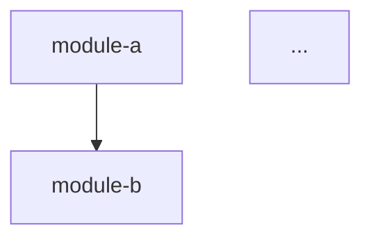
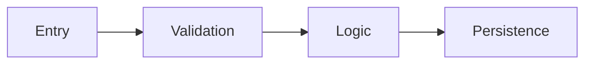
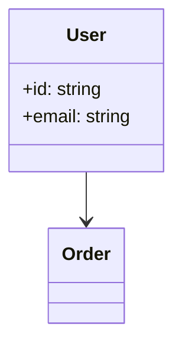

# Exploration Dimensions — Execution Guide

This document provides detailed analysis instructions for each of the 6 exploration dimensions. SubAgents (codebase-analyzer, codebase-pattern-finder) reference this guide to ensure consistent, evidence-based analysis.

**Core principle**: Document what IS, not what SHOULD BE. Every claim must cite `file:line`.

---

## Dimension 1: Architecture Overview

**Handled by**: codebase-analyzer

### What to Analyze

**Module Decomposition**
- Identify top-level modules/packages by directory structure
- For each module: name, directory path, approximate file count, primary responsibility (1 sentence)
- Detect organization pattern: by-feature, by-layer, by-type, hybrid

**Architecture Pattern Detection**

| Pattern | Detection Signals |
|---------|-------------------|
| MVC | Directories named `models/`, `views/`, `controllers/` or framework equivalents (Django views, Rails controllers, Spring @Controller) |
| Layered | Clear separation into `presentation/`, `business/`/`service/`, `data/`/`repository/` directories |
| Hexagonal/Clean | `ports/`, `adapters/`, `domain/`, `infrastructure/` directories; interfaces at domain boundary |
| Microservices | Multiple independent `service-*/` directories with own dependency manifests |
| Event-driven | Event bus/emitter patterns, message queue consumers/producers, pub-sub |
| Monolith | Single deployment unit, shared database, no service boundaries |
| Plugin | Plugin registration, hook systems, extension points |

Report the **dominant pattern** with evidence. If mixed, report primary + secondary.

**Module Dependency Graph**
- Trace inter-module imports (one module importing from another)
- Produce a Mermaid `graph TD` showing module-to-module dependencies
- Identify the module with highest fan-in (most depended upon) and highest fan-out (most dependent)

**Design Pattern Instances**
- Scan for common patterns: Factory, Strategy, Observer, Repository, Singleton, Builder, Decorator, Middleware
- For each found: pattern name, file:line, brief evidence (e.g., "Factory method `createUser()` at `src/factories/user.ts:15`")
- Only report patterns with clear structural evidence; do not speculate

### Output Format

```markdown
## Architecture Overview

### Module Decomposition
| Module | Path | Files | Responsibility |
|--------|------|-------|----------------|

### Architecture Pattern
**Primary**: [pattern] — [evidence summary]
**Secondary**: [pattern, if any] — [evidence summary]

### Module Dependency Graph


### Design Patterns Found
| Pattern | Location | Evidence |
|---------|----------|----------|
```

---

## Dimension 2: Entry Points & API Surface

**Handled by**: codebase-analyzer

### What to Analyze

**Application Entry Points**

| Language | Detection Pattern |
|----------|-------------------|
| Python | `if __name__ == "__main__"`, `@click.command`, `@app.command`, `def main()`, `entry_points` in setup.py/pyproject.toml |
| JavaScript/TypeScript | `"main"` in package.json, `"bin"` in package.json, Express/Fastify `app.listen()`, Next.js `pages/` or `app/` |
| Java | `public static void main(String[])`, Spring `@SpringBootApplication`, `@RestController` |
| Go | `func main()`, `http.ListenAndServe`, Cobra commands |
| Rust | `fn main()`, `#[tokio::main]`, Actix/Axum router setup |
| C/C++ | `int main()`, `WinMain` |

For each entry point: file:line, type (CLI/HTTP/worker/scheduled), brief description.

**Public API Surface**

| Framework | Endpoint Detection |
|-----------|-------------------|
| Express/Fastify/Koa | `app.get/post/put/delete()`, `router.*()` |
| Django | `urlpatterns`, `@api_view` |
| Flask | `@app.route`, `@blueprint.route` |
| Spring | `@GetMapping`, `@PostMapping`, `@RequestMapping` |
| FastAPI | `@app.get/post`, `@router.*` |
| gRPC | `service` definitions in `.proto` files |
| GraphQL | `type Query`, `type Mutation`, resolver files |
| Go net/http | `http.HandleFunc`, `mux.Handle`, Gin/Chi route registration |

For each endpoint: method, path/name, handler file:line, auth (if detectable).

**Configuration Surface**
- Environment variable reads: `os.getenv`, `process.env.*`, `os.Getenv`, `std::env`
- Config files: `.env`, `config.yaml`, `application.properties`, `settings.py`
- Feature flags: any toggle/flag patterns

**Plugin/Extension Points**
- Middleware chains, event hooks, plugin registries

### Output Format

```markdown
## Entry Points & API Surface

### Entry Points
| Type | Location | Description |
|------|----------|-------------|

### API Endpoints
| Method | Path | Handler | Auth |
|--------|------|---------|------|

### Configuration
| Source | Key/File | Location | Description |
|--------|----------|----------|-------------|
```

---

## Dimension 3: Data Flow & State Management

**Handled by**: codebase-analyzer

### What to Analyze

**Data Models**

| ORM/Framework | Detection Pattern |
|---------------|-------------------|
| SQLAlchemy | `class X(Base)`, `class X(db.Model)` |
| Django ORM | `class X(models.Model)` |
| TypeORM | `@Entity()`, `@Column()` |
| Prisma | `model X { ... }` in `schema.prisma` |
| Mongoose | `new Schema({...})`, `mongoose.model()` |
| GORM | struct with `gorm` tags |
| Protobuf | `message X { ... }` in `.proto` files |
| GraphQL | `type X { ... }` in schema files |

For each model: name, file:line, key fields (top 5), relationships to other models.

**Data Flow Paths**
- Trace at least 1-2 representative request paths: entry point → validation → business logic → persistence → response
- Produce Mermaid `flowchart LR` for the most important flow

**State Management**
- Frontend: Redux, Zustand, MobX, Vuex/Pinia, Svelte stores, React Context
- Backend: session stores, in-memory caches, stateless design
- Database: SQL, NoSQL, key-value, file-based

**External Data Integrations**
- API clients (HTTP, gRPC), message queue producers/consumers, file I/O, cloud service SDKs

### Output Format

```markdown
## Data Flow & State Management

### Data Models
| Model | File | Key Fields | Relationships |
|-------|------|------------|---------------|

### Key Data Flow


### State Management
[Pattern description with evidence]

### External Data Integrations
| Integration | Type | File | Description |
|-------------|------|------|-------------|
```

---

## Dimension 4: Domain Model & Business Logic

**Handled by**: codebase-analyzer

### What to Analyze

**Core Domain Entities**
- Distinguish entities (identity-bearing, mutable) from value objects (identity-free, immutable)
- Identify aggregate roots (if DDD patterns are present)
- Produce Mermaid `classDiagram` for entity relationships

**Business Rules & Invariants**
- Validation logic that enforces business constraints (not just type validation)
- Authorization/permission checks tied to business rules
- Calculation logic (pricing, scoring, scheduling algorithms)
- State machine transitions (order status, workflow steps)

**Business Logic Hotspots**
- Files/functions with the densest business logic (highest ratio of conditionals to total lines)
- Heuristic: files in domain/business/service layers with many `if/switch/case` blocks

**Key Algorithms**
- Any non-trivial algorithm (sorting, matching, scheduling, optimization)
- For each: name/purpose, file:line, brief description of approach

### Output Format

```markdown
## Domain Model & Business Logic

### Domain Entities


### Business Rules
| Rule | Location | Description |
|------|----------|-------------|

### Key Algorithms
| Algorithm | File | Approach |
|-----------|------|----------|
```

---

## Dimension 5: Dependencies & Integrations

**Handled by**: codebase-pattern-finder

### What to Analyze

**Direct Dependency Inventory**
- Parse dependency manifest (package.json, requirements.txt, pyproject.toml, pom.xml, go.mod, Cargo.toml)
- For each dependency: name, version/constraint, purpose category (HTTP, logging, testing, ORM, auth, validation, utilities)
- Count: total dependencies, dev dependencies

**Internal Module Coupling**
- For each module directory, count:
  - **Fan-in**: how many other modules import from it
  - **Fan-out**: how many other modules it imports from
- Identify: most coupled modules (high fan-in + fan-out), most isolated modules

**External Service Integrations**
- HTTP clients: base URLs, API clients, SDK instantiations
- Database connections: connection strings, pool configurations
- Message queues: producer/consumer configurations
- Cloud services: AWS/GCP/Azure SDK usage

**Dependency Injection Patterns**
- DI containers (Spring, Inversify, dig, wire)
- Manual wiring (constructor injection, factory functions)
- Global singletons

### Output Format

```markdown
## Dependencies & Integrations

### Dependency Summary
| Category | Count | Notable |
|----------|-------|---------|
| Runtime | N | [top 3 by importance] |
| Dev | N | [test framework, linter] |

### Internal Coupling
| Module | Fan-in | Fan-out | Coupling |
|--------|--------|---------|----------|

### External Services
| Service | Type | File | Connection |
|---------|------|------|------------|
```

---

## Dimension 6: Code Health & Complexity

**Handled by**: codebase-pattern-finder

### What to Analyze

**File Size Distribution**
- Measure lines per file for all source files in scope
- Report: P50, P90, P99, max
- List top 5 largest files

**Function/Method Length**
- Heuristic: count lines between function/method declarations
- Report: P50, P90 estimate
- List top 5 longest functions

**Complexity Hotspots**
- Heuristic: count branching keywords per file (`if`, `else`, `elif`, `else if`, `for`, `while`, `switch`, `case`, `try`, `catch`, `except`, `&&`, `||`, `?:`, `match`)
- Normalize by file length: branches per 100 lines
- List top 5 most complex files

**Test Coverage Landscape**
- Count test files per source directory
- Calculate test-to-source file ratio (per directory and overall)
- Identify directories with zero test coverage
- Detect test framework from imports

**Duplication Signals**
- Look for files with very similar names or structure (e.g., `userController.ts` / `orderController.ts` with identical shape)
- Look for repeated code blocks (same function signature or structure appearing 3+ times)
- Report as observations, not critiques

**Technical Debt Markers**
- Search for: `TODO`, `FIXME`, `HACK`, `XXX`, `WORKAROUND`, `TEMP`, `DEPRECATED`
- For each: keyword, file:line, surrounding context (the comment text)
- Count total per keyword

### Output Format

```markdown
## Code Health

### File Size Distribution
| Percentile | Lines |
|------------|-------|
| P50 | N |
| P90 | N |
| P99 | N |
| Max | N ([file]) |

### Complexity Hotspots
| File | Branches | Lines | Density |
|------|----------|-------|---------|

### Test Landscape
| Directory | Source Files | Test Files | Ratio |
|-----------|-------------|------------|-------|

### Technical Debt Markers
| Keyword | Count | Top Locations |
|---------|-------|---------------|
```
